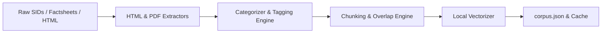
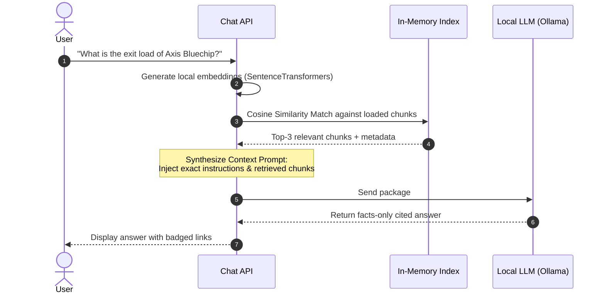

# Detailed RAG Architecture: Groww FAQ Assistant

This document defines the comprehensive, detailed system architecture for the **Retrieval-Augmented Generation (RAG) based Groww FAQ Assistant**. The architecture bridges the factual Mutual Fund scheme queries (derived from [problemStatement.txt](file:///c:/Users/hp/Documents/Mutual%20Fund%20Chatbot/docs/problemStatement.txt)) and the **23 curated Groww stock/mutual fund URLs** (documented in [context.md](file:///c:/Users/hp/Documents/Mutual%20Fund%20Chatbot/context.md)).

---

## 1. System Component Diagram

The FAQ Assistant uses a lightweight, self-contained RAG design. Rather than relying on heavy third-party cloud database services, it uses a **local in-memory vector similarity index**, achieving near-zero latency, maximum simplicity, and effortless deployment.

```mermaid
graph TD
    %% Client Tier
    subgraph Client [Client Tier - Browser]
        UI[Groww Chat Widget]
        ExP[Example Prompts Hub]
        Disc[Facts-Only Disclaimer Widget]
    end

    %% Application Tier
    subgraph AppService [Application Service - FastAPI / Python]
        API[Chat API Gateway]
        PII[PII Detection & Regex Sanitizer]
        Guard[Advisory & Speculation Refusal Guard]
        Ret[Retrieval Coordinator]
        Embed[Local Embedding Client]
        Syn[Citation & Prompt Builder]
        SCH[Background Scheduler - APScheduler]
    end

    %% Data Tier
    subgraph LocalData [Data Tier - Local In-Memory Cache]
        Index[In-Memory Similarity Store]
        Corpus[Unified corpus.json File]
    end

    %% Local Model Tier (100% Free & Offline)
    subgraph ModelService [LLM Tier - Local]
        LLM[Local LLM - Ollama: Qwen2.5 / Llama 3]
    end

    %% Connectors
    UI -->|1. Submit User Query| API
    API -->|2. Regex Check| PII
    PII -->|3. Policy Validation| Guard
    Guard -->|4. Request Vector| Embed
    Embed -->|5. Query Similarity| Index
    Index <-->|Read Chunks & Metadata| Corpus
    Index -->>|6. Top-K Chunks + Sources| Ret
    Ret -->|7. Structure Prompt| Syn
    Syn -->|8. Send Context Prompt| LLM
    LLM -->|9. Returns Factual Cited Answer| Syn
    Syn -->|10. Formats JSON Response| API
    API -->|11. Renders Markdown & Badges| UI
    
    %% Scheduler Connectors
    SCH -->|12. Triggers Daily Sync Ingestion| Index
    SCH -->|12. Triggers Daily Sync Ingestion| Corpus
```

---

## 2. Ingestion & Document Processing Pipeline

The ingestion pipeline is designed to parse documents offline and compile them into a unified, lightweight `corpus.json` file. 



### 2.1 Ingestion Mapping for the 11 Mutual Fund Query Types
During parsing, mutual fund documents are categorized into **eleven (11) distinct query types** and tagged with metadata to enable highly precise matching during retrieval:

1.  **Expense Ratio:** Extracted from the annual operating expenses tables in the SIDs/Factsheets.
2.  **Exit Load:** Extracted from the "Load Structure" section of the scheme documents.
3.  **Minimum Investment:** Pulled from "Minimum Application Amount" fields (SIP & Lump Sum).
4.  **Lock-in Period:** Extracted from "Redemption Constraints" sections (especially ELSS schemes).
5.  **Risk Classification:** Extracted from the riskometer details (e.g., Low to Very High).
6.  **Benchmark:** Identified via the official "Scheme Benchmark Index" text.
7.  **Fund Management:** Extracted from AUM, fund asset size, and Asset Management Company (AMC) overview sections.
8.  **Fund Manager Details:** Extracted from tables describing key personnel, listing names, tenures, qualifications, and educational credentials.
9.  **Document Access:** Mapped to instructions and procedures for downloading official statements and scheme brochures.
10. **Fund Category:** The classification of the fund based on its investment strategy and asset allocation (e.g., Equity: Large Cap).
11. **Investment Objectives:** The financial goals and strategy of the scheme.

### 2.2 Ingestion Mapping for the 5 Curated Stocks
Information is parsed from the 5 supported Groww Stock pages and structured into metrics:
*   **Stocks Curated:** Max Financial Services, AU Small Finance Bank, The Federal Bank, Glenmark Pharmaceuticals, and Indian Bank.
*   **Metrics Captured:** Market Capitalization, P/E Ratio, Dividend Yield, 52-Week Range, Industry/Sector, Company Overview, and **Company Management Data** (Promoters and Board Directors).

### 2.3 Unified Chunk Schema Definitions
Each document or page is broken into chunks of ~500–700 characters (with 100-character overlaps). The unified schema structures both types of corpus data:

```json
[
  {
    "chunk_id": "mf_axis_bluechip_manager_jinesh",
    "type": "mutual_fund",
    "query_type": "fund_manager_details",
    "scheme_name": "Axis Bluechip Fund",
    "content": "Mr. Jinesh Gopani is the Head of Equity and has been managing the Axis Bluechip Fund since November 2016. He holds a Master of Management Studies (MMS) in Finance and has over 20 years of experience in equity research and fund management.",
    "source_metadata": {
      "title": "Axis Bluechip Fund SID (2024)",
      "source_name": "Axis Mutual Fund AMC"
    }
  },
  {
    "chunk_id": "stock_federal_bank_market_cap",
    "type": "stock",
    "query_type": "market_cap",
    "stock_name": "The Federal Bank Ltd",
    "content": "The Federal Bank Ltd exhibits a Market Capitalization of approximately ₹34,500 Crores with a P/E Ratio of 12.34 and an active dividend yield of 1.2%.",
    "source_metadata": {
      "title": "The Federal Bank Ltd Stock Details",
      "url": "https://groww.in/stocks/the-federal-bank-ltd"
    }
  }
]
```

### 2.4 Periodic Ingestion & Dynamic Data Refresh (Scheduler)
To ensure the assistant always serves fresh details (e.g., matching the latest AUM, fund manager shifts, and current stock stats) without service redeployments, a **Background Ingestion Scheduler** is integrated:
*   **Trigger Schedule:** Runs periodically in the background (e.g., daily at 18:30 IST after stock market close, and weekly for mutual fund factsheets).
*   **Execution Flow:**
    1.  **Scraping Trigger:** The scheduler spawns a scraping process that fetches the latest HTML metrics from the 5 supported stock URLs and parses newly added AMC mutual fund PDFs/documents.
    2.  **Reparsing & Chunking:** New documents are parsed, chunked, and vectorized locally.
    3.  **Corpus Overwrite:** The fresh chunks compile and overwrite `corpus.json` atomically.
    4.  **In-Memory Hot-Reload:** The scheduler signals the `In-Memory Similarity Store` to hot-reload `corpus.json` from disk into the RAM cache. All subsequent queries utilize the fresh cache instantly.

---

## 3. Ingress Guardrail System (PII Redaction & Refusal Checks)

To guarantee absolute compliance with data privacy regulations and investment advisory policies, the Gateway runs user queries through a dual-guardrail system before hitting the semantic index or LLM.

```
       [ User Query ]
             │
             ▼
┌──────────────────────────┐
│  PII Protection Scanner  │──(Matches PAN, Aadhaar, Email, etc.)──► [ Block & Return PII Alert ]
└──────────────────────────┘
             │ (Passed)
             ▼
┌──────────────────────────┐
│  Advisory Refusal Check  │──(Matches "should I buy", "better returns", etc.)──► [ Deflect & Return Refusal ]
└──────────────────────────┘
             │ (Passed)
             ▼
    [ Proceed to RAG ]
```

### 3.1 PII Protection Engine
*   **Execution:** Fast, local regex matches.
*   **Rules Evaluated:**
    *   *PAN:* `\b[A-Z]{5}[0-9]{4}[A-Z]{1}\b`
    *   *Aadhaar:* `\b[2-9]{1}[0-9]{3}\s[0-9]{4}\s[0-9]{4}\b` or `\b[2-9]{1}[0-9]{11}\b`
    *   *Phone:* `\b(\+91[\-\s]?)?[6-9]\d{9}\b`
    *   *Email:* `\b[A-Za-z0-9._%+-]+@[A-Za-z0-9.-]+\.[A-Za-z]{2,}\b`
*   **Action:** If matched, terminates processing immediately and returns a friendly privacy alert.

### 3.2 Advisory & Speculation Refusal Check
*   **Keyword Tokens scanned:** `should i buy`, `best stock`, `recommend a fund`, `price forecast`, `market direction`, `SBI vs Axis which is better`.
*   **Action:** Directly returns the standard refusal template pointing the user to **Groww Academy** and **AMFI** educational portals.

---

## 4. Semantic Retrieval & Prompt Engineering

If the query passes all guardrails, the **Retrieval Coordinator** executes the search.



### 4.1 Similarity Engine Details
*   **Distance Metric:** Cosine similarity computed locally via NumPy:
    $$\text{Similarity} = \frac{\vec{q} \cdot \vec{d}}{\|\vec{q}\| \|\vec{d}\|}$$
*   **Vectorization:** Embeddings generated locally using `nomic-embed-text` via the local Ollama embeddings API (100% free, runs entirely offline, requires no external API keys).

### 4.2 LLM System Prompt Instructions
To guarantee **zero hallucinations** and enforce strict citations, the synthesizer feeds the LLM a structured prompt:

```text
You are a facts-only, regulatory-compliant financial assistant for Groww. 
Your objective is to answer the user's question using ONLY the retrieved context chunks below.

---
RETIRED CONTEXT CHUNKS:
[1] Content: "The exit load for redemptions within 1 year from allotment is 1.00%."
Source: Axis Bluechip Fund SID (2024)

[2] Content: "The P/E Ratio of The Federal Bank Ltd is 12.34."
Source: The Federal Bank Ltd (https://groww.in/stocks/the-federal-bank-ltd)
---

STRICT INSTRUCTIONS:
1. If the answer cannot be found in the context chunks, say: "I do not have this information in my verified records."
2. Never formulate answers based on external knowledge.
3. Every factual statement must be cited immediately with the exact source metadata in square brackets:
   - For Mutual Fund details: [Source: Document Title]
   - For Stock details: [Source: Stock Name (URL)]
4. Never give recommendations, buy/sell guidance, or advisory inputs. Refuse such queries politely.
```

---

## 5. Citation & Document Access Resolution

When the LLM outputs citations in the defined format, the **Groww Chat UI** parses the response and applies specific visual indicators:

### 5.1 Mutual Fund Document Citations
*   **Format:** `[Source: Document Title]`
*   **Visual Indicator:** Renders as a dedicated static **Verified Document Badge** (e.g., `📄 Source: Axis Bluechip Fund SID (2024)`).

### 5.2 Stock URL Citations
*   **Format:** `[Source: Stock Name (URL)]`
*   **Visual Indicator:** Renders as an interactive, clickable hyperlink badge linking the user directly to the target stock page (e.g., `📈 Source: The Federal Bank Ltd`).

---

## 6. Technology Stack & Rationale

| Tier | Technology Choice | Rationale for Extreme Simplicity |
| :--- | :--- | :--- |
| **Web Interface** | HTML5 / Vanilla CSS / ES6 JavaScript | Renders smoothly in any web framework, zero bundle size overhead, easy to embed as a chat widget. |
| **Application API**| FastAPI (Python) | High-speed async routing, native support for Python NLP libraries, and clean automatic API documentation (OpenAPI). |
| **Similarity Index**| Local NumPy / Vector Cache | With a combined corpus size of <1,000 chunks, a local in-memory cosine similarity matrix calculation is calculated in under 3ms, saving database maintenance costs. |
| **Embeddings** | `nomic-embed-text` (via Ollama) | Standard high-fidelity text embedding model running locally via Ollama, completely offline, zero latency, and zero cost. |
| **Generative LLM** | **Ollama** running `qwen2.5:7b-instruct` (or `qwen2.5:1.5b-instruct` for low-resource environments) | 100% free and open-source, runs entirely locally on CPU/GPU, zero usage fees, requires no API keys or internet connection. |
| **Background Scheduler**| **APScheduler** (Advanced Python Scheduler) | A lightweight, in-process Python library that schedules and executes periodic data synchronization and crawling tasks directly within the FastAPI thread pool. |

---

## 7. End-to-End Walkthrough of a Chat Request

### Scenario A: User queries one of the 9 Mutual Fund Query Types (Fund Manager Details)
1.  **User Input:** *"Who is the fund manager of Axis Bluechip Fund?"*
2.  **PII Scan:** Clean (No PII matched).
3.  **Refusal Scan:** Clean (No advisory tokens matched).
4.  **Retrieval:** The embedding matches chunk `mf_axis_bluechip_manager_jinesh` with high similarity.
5.  **Context Construction:** The synthesizer packs the chunk and specifies `Source: Axis Bluechip Fund SID (2024)`.
6.  **LLM Processing:** Local LLM (via Ollama) answers:
    > "Axis Bluechip Fund is managed by Mr. Jinesh Gopani since November 2016 [Source: Axis Bluechip Fund SID (2024)]."
7.  **Client UI:** Renders the text and converts `[Source: ...]` into a verification badge:
    `📄 Source: Axis Bluechip Fund SID (2024)`

### Scenario B: User queries one of the 5 Stocks (P/E Ratio & Promoters)
1.  **User Input:** *"What is the P/E ratio and who manages Federal Bank?"*
2.  **PII Scan:** Clean.
3.  **Refusal Scan:** Clean.
4.  **Retrieval:** The embedding matches chunk `stock_federal_bank_pe` and promoter details with high similarity.
5.  **Context Construction:** The synthesizer packs the stock details and specifies `Source: The Federal Bank Ltd (https://groww.in/stocks/the-federal-bank-ltd)`.
6.  **LLM Processing:** Local LLM (via Ollama) answers:
    > "The P/E Ratio of The Federal Bank Ltd is 12.34. The bank is managed by Shyam Srinivasan (MD & CEO) [Source: The Federal Bank Ltd (https://groww.in/stocks/the-federal-bank-ltd)]."
7.  **Client UI:** Renders the answer, parsing the citation into a clickable, interactive stock link:
    `📈 Source: The Federal Bank Ltd` (pointing to `https://groww.in/stocks/the-federal-bank-ltd`)
