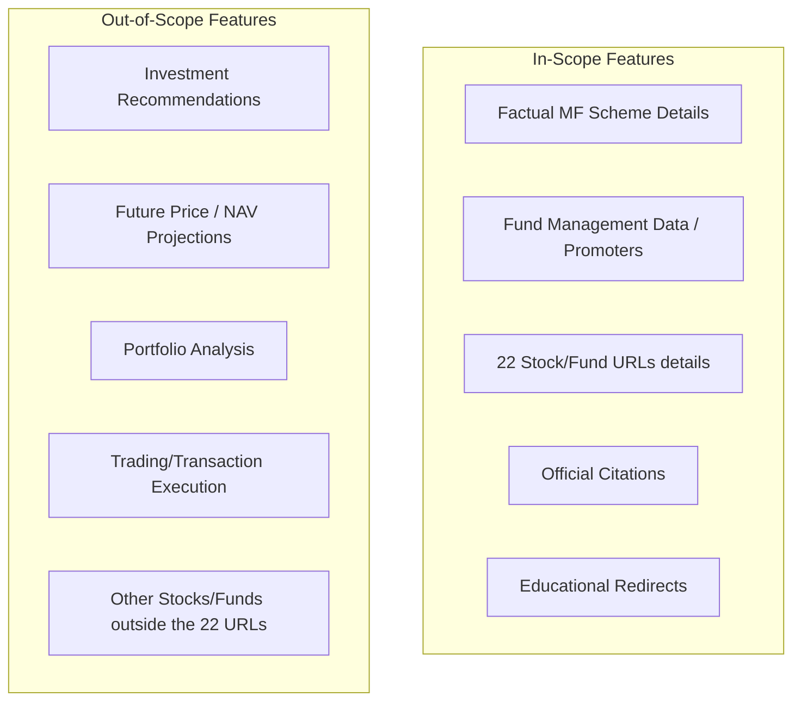

# Project Brief: Groww FAQ Assistant (Mutual Funds & Stocks)

This document serves as the central context and structured project brief for the **Retrieval-Augmented Generation (RAG) based Groww FAQ Assistant**, answering queries about both Mutual Fund schemes and 22 specific Stocks/Funds. It defines the requirements, constraints, boundaries, and success metrics for the application.

---

## 1. Objective

To build a secure, facts-only, RAG-based conversational assistant that allows Groww users to query and retrieve official, cited information regarding **Mutual Fund schemes** and **twenty-two (22) specific stock/mutual fund detail pages** on the Groww platform. The system acts strictly as an informational tool, utilizing a curated corpus of verified public documents (AMCs, AMFI, SEBI) and official Groww stock/fund pages to prevent hallucinations, while ensuring zero retention of personal user data.

The 23 supported stock detail pages are:
1.  **HDFC Silver ETF FoF Direct Growth:** [https://groww.in/mutual-funds/hdfc-silver-etf-fof-direct-growth](https://groww.in/mutual-funds/hdfc-silver-etf-fof-direct-growth)
2.  **Bandhan Small Cap Fund Direct Growth:** [https://groww.in/mutual-funds/bandhan-small-cap-fund-direct-growth](https://groww.in/mutual-funds/bandhan-small-cap-fund-direct-growth)
3.  **Parag Parikh Long Term Value Fund Direct Growth:** [https://groww.in/mutual-funds/parag-parikh-long-term-value-fund-direct-growth](https://groww.in/mutual-funds/parag-parikh-long-term-value-fund-direct-growth)
4.  **HDFC Mid Cap Fund Direct Growth:** [https://groww.in/mutual-funds/hdfc-mid-cap-fund-direct-growth](https://groww.in/mutual-funds/hdfc-mid-cap-fund-direct-growth)
5.  **Motilal Oswal Most Focused Midcap 30 Fund Direct Growth:** [https://groww.in/mutual-funds/motilal-oswal-most-focused-midcap-30-fund-direct-growth](https://groww.in/mutual-funds/motilal-oswal-most-focused-midcap-30-fund-direct-growth)
6.  **SBI Gold Fund Direct Growth:** [https://groww.in/mutual-funds/sbi-gold-fund-direct-growth](https://groww.in/mutual-funds/sbi-gold-fund-direct-growth)
7.  **Nippon India Small Cap Fund Direct Growth:** [https://groww.in/mutual-funds/nippon-india-small-cap-fund-direct-growth](https://groww.in/mutual-funds/nippon-india-small-cap-fund-direct-growth)
8.  **Axis Silver FoF Direct Growth:** [https://groww.in/mutual-funds/axis-silver-fof-direct-growth](https://groww.in/mutual-funds/axis-silver-fof-direct-growth)
9.  **Quant Small Cap Fund Direct Plan Growth:** [https://groww.in/mutual-funds/quant-small-cap-fund-direct-plan-growth](https://groww.in/mutual-funds/quant-small-cap-fund-direct-plan-growth)
10. **HDFC Equity Fund Direct Growth:** [https://groww.in/mutual-funds/hdfc-equity-fund-direct-growth](https://groww.in/mutual-funds/hdfc-equity-fund-direct-growth)
11. **ICICI Prudential Silver ETF FoF Direct Growth:** [https://groww.in/mutual-funds/icici-prudential-silver-etf-fof-direct-growth](https://groww.in/mutual-funds/icici-prudential-silver-etf-fof-direct-growth)
12. **SBI PSU Fund Direct Growth:** [https://groww.in/mutual-funds/sbi-psu-fund-direct-growth](https://groww.in/mutual-funds/sbi-psu-fund-direct-growth)
13. **Edelweiss US Technology Equity FoF Direct Growth:** [https://groww.in/mutual-funds/edelweiss-us-technology-equity-fof-direct-growth](https://groww.in/mutual-funds/edelweiss-us-technology-equity-fof-direct-growth)
14. **Nippon India Large Cap Fund Direct Growth:** [https://groww.in/mutual-funds/nippon-india-large-cap-fund-direct-growth](https://groww.in/mutual-funds/nippon-india-large-cap-fund-direct-growth)
15. **Axis Small Cap Fund Direct Growth:** [https://groww.in/mutual-funds/axis-small-cap-fund-direct-growth](https://groww.in/mutual-funds/axis-small-cap-fund-direct-growth)
16. **UTI Nifty 500 Value 50 Index Fund Direct Growth:** [https://groww.in/mutual-funds/uti-nifty-500-value-50-index-fund-direct-growth](https://groww.in/mutual-funds/uti-nifty-500-value-50-index-fund-direct-growth)
17. **Edelweiss Mid and Small Cap Fund Direct Growth:** [https://groww.in/mutual-funds/edelweiss-mid-and-small-cap-fund-direct-growth](https://groww.in/mutual-funds/edelweiss-mid-and-small-cap-fund-direct-growth)
18. **PGIM India Emerging Markets Equity FoF Direct Growth:** [https://groww.in/mutual-funds/pgim-india-emerging-markets-equity-fof-direct-growth](https://groww.in/mutual-funds/pgim-india-emerging-markets-equity-fof-direct-growth)
19. **Edelweiss Greater China Equity Offshore Fund Direct Growth:** [https://groww.in/mutual-funds/edelweiss-greater-china-equity-offshore-fund-direct-growth](https://groww.in/mutual-funds/edelweiss-greater-china-equity-offshore-fund-direct-growth)
20. **Invesco India Mid Cap Fund Direct Growth:** [https://groww.in/mutual-funds/invesco-india-mid-cap-fund-direct-growth](https://groww.in/mutual-funds/invesco-india-mid-cap-fund-direct-growth)
21. **Canara Robeco Small Cap Fund Direct Growth:** [https://groww.in/mutual-funds/canara-robeco-small-cap-fund-direct-growth](https://groww.in/mutual-funds/canara-robeco-small-cap-fund-direct-growth)
22. **SBI Children's Fund Investment Plan Direct Growth:** [https://groww.in/mutual-funds/sbi-children's-fund-investment-plan-direct-growth](https://groww.in/mutual-funds/sbi-children's-fund-investment-plan-direct-growth)
23. **Groww Large Cap Fund Direct Growth:** [https://groww.in/mutual-funds/groww-large-cap-fund-direct-growth](https://groww.in/mutual-funds/groww-large-cap-fund-direct-growth)

---

## 2. User Personas

### A. Factual Researcher (The Retainer)
*   **Profile:** An active or prospective Groww investor who wants to verify key metrics, financials, manager details, or company overviews without wading through lengthy PDFs or manually searching stock pages.
*   **Needs:** Fast, extremely accurate, cited mutual fund facts (SIP, lock-in, exit loads) and stock metrics (P/E ratio, market cap, management team details).

### B. Seeking Guidance (The Novice)
*   **Profile:** A retail investor seeking direction, who may ask opinion-based or advisory questions (e.g., "Which fund/stock has the best future?" or "Should I sell my Federal Bank shares?").
*   **Needs:** Gentle deflection, protection from making misinformed decisions based on AI speculation, and redirection to high-quality educational materials.

---

## 3. Functional Requirements

### 3.1 Information Retrieval & Q&A
*   **Mutual Fund Detail Extraction:** The assistant must recognize and answer the following specific query types:
    *   **Expense Ratio:** The percentage of fund assets used for administrative and operating expenses.
        *   *Example Query:* *"What is the expense ratio of Axis Bluechip Fund?"*
    *   **Exit Load:** Fees charged to investors when they redeem mutual fund units within a specific timeframe.
        *   *Example Query:* *"Is there any exit load for Axis Bluechip Fund if I withdraw in 6 months?"*
    *   **Minimum Investment:** The lowest amount required to start investing in the fund (SIP or Lump Sum).
        *   *Example Query:* *"What is the minimum SIP amount required to start investing in Parag Parikh Flexi Cap Fund?"*
    *   **Lock-in Period:** The specific timeframe during which investors cannot redeem or exit their investment (e.g., in ELSS tax-saving funds).
        *   *Example Query:* *"Does Axis Long Term Equity Fund have a lock-in period, and for how long?"*
    *   **Risk Classification:** The standardized riskometer category indicating the risk level of the fund scheme (e.g., Low, Moderate, High, Very High).
        *   *Example Query:* *"What is the riskometer classification of Axis Bluechip Fund?"*
    *   **Benchmark:** The standard index against which the fund scheme's performance and asset allocation are measured.
        *   *Example Query:* *"Which benchmark index does Axis Bluechip Fund track?"*
    *   **Fund Management:** Operational details and metrics concerning the management of the fund, including Assets Under Management (AUM), fund size, and managing AMC (Asset Management Company) details.
        *   *Example Query:* *"What is the current AUM of Axis Bluechip Fund?"* or *"Which AMC manages Axis Bluechip Fund?"*
    *   **Fund Manager Details:** Information about the professional(s) managing the fund, including names, tenure, qualifications, and history.
        *   *Example Query:* *"Who is the current fund manager for Axis Bluechip Fund and what are their qualifications?"*
    *   **Document Access:** Procedures, pathways, and official instructions for accessing and downloading key files like Scheme Information Documents (SIDs), Key Information Memorandums (KIMs), account statements, or capital gains summaries.
        *   *Example Query:* *"How can I download the Scheme Information Document (SID) or transaction statement for Axis Bluechip Fund?"*
    *   **Fund Category:** The classification of the fund based on its investment strategy and asset allocation.
        *   *Example Query:* *"What is the fund category of Groww Large Cap Fund?"*
    *   **Investment Objectives:** The financial goals and strategy of the scheme.
        *   *Example Query:* *"What are the investment objectives of the scheme?"*
*   **Stock Detail Extraction:** Accurately retrieve and present the following attributes from the 23 supported pages:
    *   Market Capitalization
    *   P/E (Price-to-Earnings) Ratio
    *   Dividend Yield
    *   52-Week High / Low
    *   Industry / Sector Classification
    *   Company Overview / About the Company
    *   **Company Management Data:** Details of key promoters, board members, CEO, executive leadership, and corporate management profiles.
*   **Mandatory Citations:** Every response must contain a clear, verifiable citation referencing the specific AMC factsheet, SID, or official Groww stock/fund URL from which the data was extracted.

### 3.2 Guardrails & Deflection
*   **Advisory Deflection:** Detect and politely decline questions requesting recommendations, return comparisons, buy/sell triggers, or portfolio advice.
*   **Educational Redirection:** Provide helpful links to official educational resources (e.g., AMFI Educational Portal or Groww Academy) when deflecting advisory queries.

### 3.3 User Interface (UI)
*   **Simple Interactive Chat:** A clean, responsive chat interface where users can type queries.
*   **Example Prompts:** Pre-configured clickable questions covering key parameters (e.g., *"What is the exit load of Axis Bluechip Fund?"*, *"Who is the fund manager for SBI Bluechip?"*, *"Show me the management team of Glenmark"*).
*   **Facts-Only Disclaimer:** A prominent, persistent header or footer stating that the bot is informational only, relies strictly on official documents and the 22 supported pages, and does not provide financial advice.
*   **Retrieval Citations Display:** A dedicated visual element or badge next to or within answers displaying the verified source document or Groww Stock URL.

---

## 4. Non-Functional Requirements

*   **Factuality & Hallucination Resistance:** The chatbot's generation temperature and system prompt must be tuned to strictly prevent answering using external knowledge or generating unsubstantiated claims.
*   **Transparency:** All source materials must be directly traceable via cited references or stock URLs.
*   **Privacy & Data Minimalisation:**
    *   The application must **never** collect, store, or process Personally Identifiable Information (PII) or financial credentials (e.g., PAN, Aadhaar, Account numbers, email, phone numbers, OTPs).
    *   Any detected PII patterns in inputs must be actively redacted or rejected before being processed by the retrieval engine.
*   **Performance & Latency:** Retrieval and response generation should happen within acceptable interactive conversational thresholds (under 2-3 seconds).

---

## 5. Constraints

*   **Technology Constraints:** Implement using standard HTML/CSS/JS (vanilla or simple robust UI layout) with a clean RAG backend pipeline.
*   **Information Sources Constraint:** The assistant is strictly constrained to a curated corpus of official mutual fund documents (SIDs, KIMs, Factsheets) and the **23 official Groww URLs** listed above.
*   **Regulatory Constraint (SEBI):** The chatbot cannot function as an investment adviser. It must remain purely informational. No comparative buy/sell calls or future projections are permitted to avoid bias.

---

## 6. Deliverables

1.  **Curated Document Corpus:** A structured local database (or parsed text file) containing the parsed contents of official MF documents and the 23 Groww URLs.
2.  **RAG Retrieval Engine:** Core logic mapping user questions to the relevant sections of MF documents and the 23 stock/fund profiles.
3.  **Conversational Chat Interface:** A premium, web-based UI matching Groww's sleek branding, featuring:
    *   Chat area with prompt bubbles
    *   Example questions
    *   Facts-only disclaimer
    *   Citations display
4.  **Redaction Pipeline:** A light, regex-based or rule-based filter that scans user inputs for PII patterns and alerts the user or redacts the text.

---

## 7. Success Criteria

*   **Factual Accuracy Rate:** $100\%$ of generated factual stock and fund details (including fund management/promoter data) match the source documents in the corpus.
*   **Zero Advisory Leakage:** $100\%$ deflection rate of advisory, comparative, or opinion-based questions.
*   **Zero PII Collection:** $0\%$ storage or leakage of PII inputs (PAN, Aadhaar, phone numbers, bank accounts) in chat logs or backend databases.
*   **Citation Compliance:** Every factual answer successfully matches and presents a corresponding verified citation.

---

## 8. Scope Boundaries

---

## 9. Query Handling & Response Scenarios

The chatbot must handle user queries according to their category, either replying with verified facts and citations or refusing/deflecting in accordance with security and regulatory guidelines.

### A. Successful Factual Scenarios

#### Scenario 1: Fund Management Data Query
*   **User Query:** *"Who is the fund manager of Axis Bluechip Fund and what is its current AUM?"*
*   **Bot Handling:** Retrieve the relevant factual details from the corpus, construct a prompt, and generate a direct response with verified document citations.
*   **Response Template:**
    > "Axis Bluechip Fund is managed by Mr. Jinesh Gopani since November 2016. The current Assets Under Management (AUM) for the fund is ₹35,820 Crores [Source: Axis Bluechip Fund SID (2024)]."

### B. Refusal & Deflection Scenarios

#### Scenario 2: Advisory or Return Comparison
*   **User Query:** *"Which stock should I buy for high returns?"* or *"Is Federal Bank better than Indian Bank?"*
*   **Bot Handling:** Politely decline and redirect.
*   **Response Template:**
    > "I am a facts-only assistant designed to provide official stock and fund details and cannot offer investment advice, comparisons, or buy/sell recommendations. For investment decisions, please refer to official scheme materials or consult a SEBI-registered financial advisor. You can read more about investing basics on the [AMFI Educational Portal](https://www.amfiindia.com) or [Groww Academy](https://groww.in/academy)."

#### Scenario 3: Personal Identifiable Information (PII) Entered
*   **User Query:** *"Can you check the status of PAN ABCDE1234F?"* or *"My phone is 9876543210, send me my OTP."*
*   **Bot Handling:** Immediately flag the input, redact/refuse to process, and remind the user of privacy practices.
*   **Response Template:**
    > "For your security, please do not share personal information such as PAN, Aadhaar, phone numbers, or account details. I do not collect, store, or process personal data, and I cannot access your personal Groww account details. For account-specific assistance, please visit the Help & Support section on the Groww App."

#### Scenario 4: Unverifiable / Out-of-Corpus Query
*   **User Query:** *"What will be the price of Glenmark tomorrow?"* or *"Why is AU Small Finance Bank share price falling today?"*
*   **Bot Handling:** Gracefully state the limit of the curated facts database.
*   **Response Template:**
    > "I do not have real-time market forecasting capabilities or data regarding future price movements in my verified corpus. I can only provide current factual details extracted from the official Groww profiles for the twenty-three supported companies/funds and official mutual fund documents."

